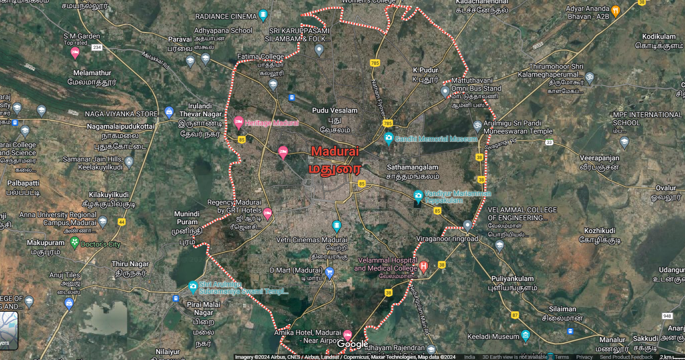
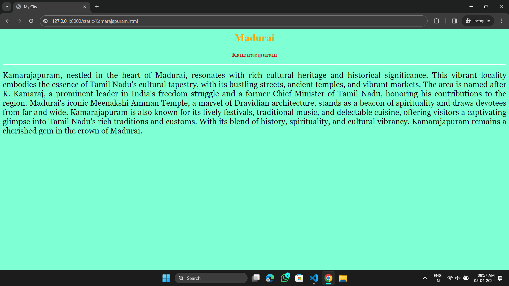
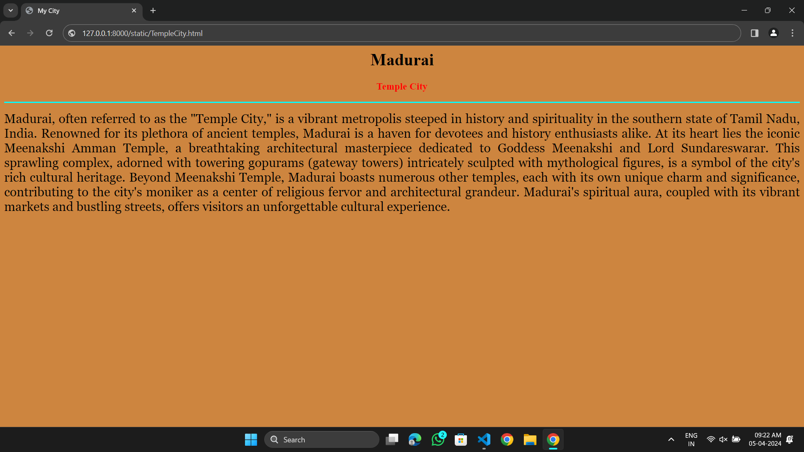
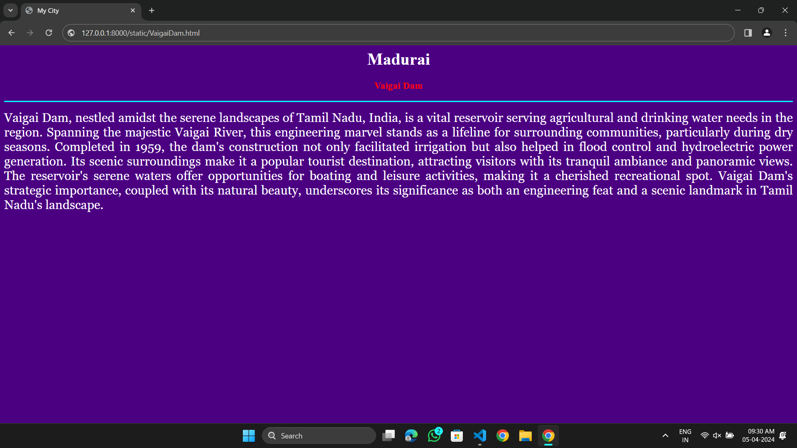
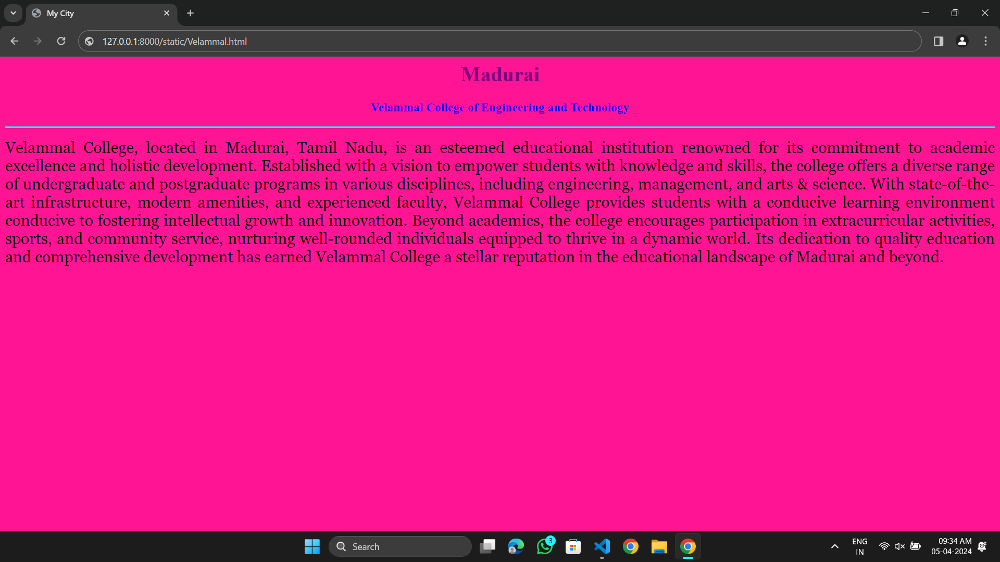

# Ex04 Places Around Me
## Date: 01-04-2024
## Name: Deepak R
## Roll.No: 212223040031
## Dept: CSE

## AIM
To develop a website to display details about the places around my house.

## DESIGN STEPS

### STEP 1
Create a Django admin interface.

### STEP 2
Download your city map from Google.

### STEP 3
Using ```<map>``` tag name the map.

### STEP 4
Create clickable regions in the image using ```<area>``` tag.

### STEP 5
Write HTML programs for all the regions identified.

### STEP 6
Execute the programs and publish them.

## CODE
```
map.html

<html>
    <head>
        <title>MAP APP</title>
    </head>
    <body>
        <h1 align="center">Madurai</h1>
        <h2 align="center"> Deepak R(212223040031)</h2>
        <center>
            

            <map name="image-map">
                <area target="" alt="Temple City" title="Temple City" href="TempleCity.html" coords="662,557,295,643" shape="rect">
                <area target="" alt="Vaigai Dam" title="Vaigai Dam" href="VaigaiDam.html" coords="761,224,82" shape="circle">
                <area target="" alt="Velammal College of Engineering and Technology" title="Velammal College of Engineering and Technology" href="Velammal.html" coords="869,726,1010,704,1069,729,1001,757,937,757" shape="poly">
                <area target="" alt="Meenakshi Temple" title="Meenakshi Temple" href="MeenakshiTemple.html" coords="600,362,97" shape="circle">
                <area target="" alt="Kamarajapuram " title="Kamarajapuram" href="Kamarajapuram.html" coords="865,394,1042,468" shape="rect">
</center>
</map>
    </body>
</html>
```
```
Kamarajapuram.html

<html>
    <head>
        <title>My City</title>
    </head>
    <body bgcolor="Aquamarine">
        <h1 align="center">
        <font color="orange"><b>Madurai</b></font>
        </h1>
        <h3 align="center">
        <font color="FireBrick"><b>Kamarajapuram</b></font>
        </h3>
        <hr size="3" color="white">
        <p align="justify">
        <font color="black" face="Georgia" size="5">
            Kamarajapuram, nestled in the heart of Madurai, resonates with rich cultural heritage and historical significance. This vibrant locality embodies the essence of Tamil Nadu's cultural tapestry, with its bustling streets, ancient temples, and vibrant markets. The area is named after K. Kamaraj, a prominent leader in India's freedom struggle and a former Chief Minister of Tamil Nadu, honoring his contributions to the region. Madurai's iconic Meenakshi Amman Temple, a marvel of Dravidian architecture, stands as a beacon of spirituality and draws devotees from far and wide. Kamarajapuram is also known for its lively festivals, traditional music, and delectable cuisine, offering visitors a captivating glimpse into Tamil Nadu's rich traditions and customs. With its blend of history, spirituality, and cultural vibrancy, Kamarajapuram remains a cherished gem in the crown of Madurai.
        </font>
        </p>
    </body>
</html>
```
```
Meenakshi Temple.html

<html>
    <head>
        <title>My City</title>
    </head>
    <body bgcolor="RebeccaPurple">
        <h1 align="center">
        <font color="yellow"><b>Madurai</b></font>
        </h1>
        <h3 align="center">
        <font color="blue"><b>Meenakshi Temple</b></font>
        </h3>
        <hr size="3" color="cyan">
        <p align="justify">
        <font face="Georgia" size="5" color="white">
            The Meenakshi Amman Temple, situated in the ancient city of Madurai, is a mesmerizing architectural marvel that stands as a testament to Tamil Nadu's rich cultural heritage. Dedicated to Goddess Meenakshi, an incarnation of Goddess Parvati, and her consort Lord Sundareswarar (Lord Shiva), this temple complex is renowned for its stunning Dravidian architecture adorned with intricate carvings, majestic gopurams (tower gateways), and vibrant sculptures depicting mythological narratives. Pilgrims and tourists alike are drawn to its sacred ambiance and spiritual significance. The temple also hosts vibrant festivals, including the elaborate Meenakshi Thirukalyanam, celebrating the divine marriage of Meenakshi and Sundareswarar. Meenakshi Amman Temple stands as a symbol of devotion, artistry, and cultural splendor, enriching the cultural landscape of Madurai.
        </font>
        </p>
    </body>
</html>
```
```
Temple City.html

<html>
    <head>
        <title>My City</title>
    </head>
    <body bgcolor="Peru">
        <h1 align="center">
        <font color="Black"><b>Madurai 
        </b></font>
        </h1>
        <h3 align="center">
        <font color="Red"><b>Temple City</b></font>
        </h3>
        <hr size="3" color="cyan">
        <p align="justify">
        <font color="black" face="Georgia" size="5">
            Madurai, often referred to as the "Temple City," is a vibrant metropolis steeped in history and spirituality in the southern state of Tamil Nadu, India. Renowned for its plethora of ancient temples, Madurai is a haven for devotees and history enthusiasts alike. At its heart lies the iconic Meenakshi Amman Temple, a breathtaking architectural masterpiece dedicated to Goddess Meenakshi and Lord Sundareswarar. This sprawling complex, adorned with towering gopurams (gateway towers) intricately sculpted with mythological figures, is a symbol of the city's rich cultural heritage. Beyond Meenakshi Temple, Madurai boasts numerous other temples, each with its own unique charm and significance, contributing to the city's moniker as a center of religious fervor and architectural grandeur. Madurai's spiritual aura, coupled with its vibrant markets and bustling streets, offers visitors an unforgettable cultural experience.
        </font>
        </p>
    </body>
</html>

```
```
Vaigai Dam.html

<html>
    <head>
        <title>My City</title>
    </head>
    <body bgcolor="Indigo">
        <h1 align="center">
        <font color="white"><b>Madurai</b></font>
        </h1>
        <h3 align="center">
        <font color="Red"><b>Vaigai Dam</b></font>
        </h3>
        <hr size="3" color="cyan">
        <p align="justify">
        <font color="white" face="Georgia" size="5">
            Vaigai Dam, nestled amidst the serene landscapes of Tamil Nadu, India, is a vital reservoir serving agricultural and drinking water needs in the region. Spanning the majestic Vaigai River, this engineering marvel stands as a lifeline for surrounding communities, particularly during dry seasons. Completed in 1959, the dam's construction not only facilitated irrigation but also helped in flood control and hydroelectric power generation. Its scenic surroundings make it a popular tourist destination, attracting visitors with its tranquil ambiance and panoramic views. The reservoir's serene waters offer opportunities for boating and leisure activities, making it a cherished recreational spot. Vaigai Dam's strategic importance, coupled with its natural beauty, underscores its significance as both an engineering feat and a scenic landmark in Tamil Nadu's landscape.  
        </font>
        </p>
    </body>
</html>
```
```
Velammal.html

<html>
    <head>
        <title>My City</title>
    </head>
    <body bgcolor="DeepPink">
        <h1 align="center">
        <font color="purple"><b>Madurai</b></font>
        </h1>
        <h3 align="center">
        <font color="blue"><b>Velammal College of Engineering and Technology</b></font>
        </h3>
        <hr size="3" color="cyan">
        <p align="justify">
        <font face="Georgia" size="5">
            Velammal College, located in Madurai, Tamil Nadu, is an esteemed educational institution renowned for its commitment to academic excellence and holistic development. Established with a vision to empower students with knowledge and skills, the college offers a diverse range of undergraduate and postgraduate programs in various disciplines, including engineering, management, and arts & science. With state-of-the-art infrastructure, modern amenities, and experienced faculty, Velammal College provides students with a conducive learning environment conducive to fostering intellectual growth and innovation. Beyond academics, the college encourages participation in extracurricular activities, sports, and community service, nurturing well-rounded individuals equipped to thrive in a dynamic world. Its dedication to quality education and comprehensive development has earned Velammal College a stellar reputation in the educational landscape of Madurai and beyond.
        </font>
        </p>
    </body>
</html>
```

## OUTPUT











## RESULT
The program for implementing image maps using HTML is executed successfully.
